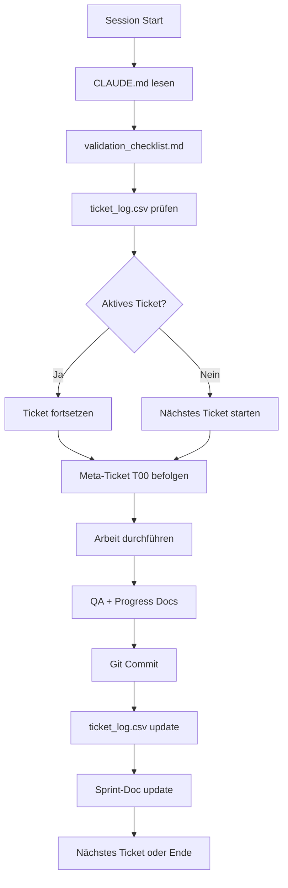

# Ticket-System Dependency Flow

## Einlesereihenfolge für optimales Verständnis

### 1. Grundlagen-Ebene (Philosophie & Regeln)
```
validation_checklist.md
    ↓
    └─> GOLDENE REGEL: Original-Informationsgehalt bewahren
    └─> Kontext-Prüfung vor Start
    └─> Inhalts-Treue während Arbeit
    └─> Qualitätskontrolle nach Arbeit
```

### 2. Sprint-Ebene (Organisation & Prozess)
```
sprint_checklist.md
    ↓
    └─> Sprint-Start Prozess
    └─> Tägliche Routine
    └─> Sprint-Abschluss
    └─> Kontinuierliche Verbesserung
```

### 3. Status-Ebene (Aktueller Stand)
```
ticket_log.csv
    ↓
    └─> Globale Übersicht aller Tickets
    └─> Status: inactive/active/completed
    └─> Fortschritt pro Ticket
```

### 4. Sprint-Dokumente (Detailstatus)
```
REED-S001/REED-S001.md
    ↓
    └─> Sprint-Ziele
    └─> Fortschrittsmetriken (20% - 2/10)
    └─> Ticket-Übersicht
    └─> Lessons Learned
```

### 5. Meta-Prozess (Arbeitsanweisungen)
```
REED-S001/REED-S001-T00.md
    ↓
    └─> Verbindliche Arbeitsschritte
    └─> Ticket-Start bis Ticket-Ende
    └─> Warnsignale für Abweichungen
    └─> Sprint-Update nach Abschluss
```

## Kreislauf-Logik



## Prioritäts-Hierarchie

1. **HÖCHSTE:** validation_checklist.md - Definiert WIE gearbeitet wird
2. **HOCH:** REED-S001-T00.md - Definiert PROZESS für jedes Ticket
3. **MITTEL:** ticket_log.csv - Zeigt WAS zu tun ist
4. **KONTEXT:** REED-S001.md - Zeigt WARUM und FORTSCHRITT
5. **REFERENZ:** sprint_checklist.md - Zeigt ORGANISATION

## Selbsterklärungs-Mechanismen

### In CLAUDE.md:
- Verweist auf Ticket-System beim Start
- Zeigt Einlesereihenfolge
- Erklärt Arbeitsregeln

### In validation_checklist.md:
- GOLDENE REGEL prominent
- Checklisten-Format selbsterklärend
- Rote Flaggen als Warnung

### In REED-S001-T00.md:
- Schritt-für-Schritt Anweisungen
- Warnsignale definiert
- Konsequenzen erklärt

### In ticket_log.csv:
- Selbsterklärendes CSV-Format
- Status-Spalten eindeutig
- Sprint-Zuordnung klar

### In REED-S001.md:
- Sprint-Ziele definiert
- Fortschritt visualisiert
- Metriken automatisch

## Verbesserungsvorschläge

1. **README.md in tickets/**: ✅ Bereits erstellt
2. **DEPENDENCY_FLOW.md**: ✅ Dieses Dokument
3. **Automatisierung**: Shell-Scripts für Status-Checks könnten helfen
4. **Visualisierung**: ASCII-Diagramme in Sprint-Docs für bessere Übersicht