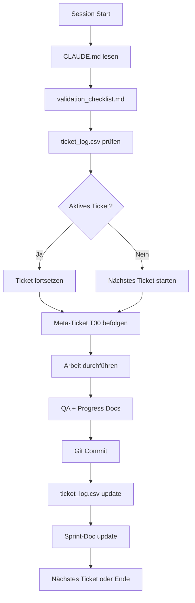

# Ticket-System Dependency Flow

## Einlesereihenfolge für optimales Verständnis

### 1. Grundlagen-Ebene (Philosophie & Regeln)
```
validation_checklist.md
    ↓
    └─> GOLDENE REGEL: Original-Informationsgehalt bewahren
    └─> Kontext-Prüfung vor Start
    └─> Inhalts-Treue während Arbeit
    └─> Qualitätskontrolle nach Arbeit
```

### 2. Sprint-Ebene (Organisation & Prozess)
```
sprint_checklist.md
    ↓
    └─> Sprint-Start Prozess
    └─> Tägliche Routine
    └─> Sprint-Abschluss
    └─> Kontinuierliche Verbesserung
```

### 3. Status-Ebene (Aktueller Stand)
```
ticket_log.csv
    ↓
    └─> Globale Übersicht aller Tickets
    └─> Status: inactive/active/completed
    └─> Fortschritt pro Ticket
```

### 4. Sprint-Dokumente (Detailstatus)
```
REED-S###/REED-S###.md (aktueller Sprint aus ticket_log.csv)
    ↓
    └─> Sprint-Ziele
    └─> Fortschrittsmetriken
    └─> Ticket-Übersicht
    └─> Lessons Learned
```

### 5. Meta-Prozess (Arbeitsanweisungen)
```
REED-S###/REED-S###-T00.md (Meta-Ticket des aktuellen Sprints)
    ↓
    └─> Verbindliche Arbeitsschritte
    └─> Ticket-Start bis Ticket-Ende
    └─> Warnsignale für Abweichungen
    └─> Sprint-Update nach Abschluss
```

## Kreislauf-Logik



## Prioritäts-Hierarchie

1. **HÖCHSTE:** validation_checklist.md - Definiert WIE gearbeitet wird
2. **HOCH:** REED-S###/REED-S###-T00.md - Definiert PROZESS für jedes Ticket
3. **MITTEL:** ticket_log.csv - Zeigt WAS zu tun ist und WELCHER Sprint aktiv
4. **KONTEXT:** REED-S###/REED-S###.md - Zeigt WARUM und FORTSCHRITT
5. **REFERENZ:** sprint_checklist.md - Zeigt ORGANISATION

## Selbsterklärungs-Mechanismen

### In CLAUDE.md:
- Verweist auf Ticket-System beim Start
- Zeigt Einlesereihenfolge
- Erklärt Arbeitsregeln

### In validation_checklist.md:
- GOLDENE REGEL prominent
- Checklisten-Format selbsterklärend
- Rote Flaggen als Warnung

### In REED-S###/REED-S###-T00.md:
- Schritt-für-Schritt Anweisungen
- Warnsignale definiert
- Konsequenzen erklärt
- Gilt für ALLE Tickets des Sprints

### In ticket_log.csv:
- Selbsterklärendes CSV-Format
- Status-Spalten eindeutig
- Sprint-Zuordnung zeigt aktuellen/aktive Sprints
- ZENTRALE Wahrheit für Sprint-Identifikation

### In REED-S###/REED-S###.md:
- Sprint-Ziele definiert
- Fortschritt visualisiert
- Metriken automatisch
- Sprint-spezifische Informationen

## Sprint-Erkennungs-Algorithmus

### Wie finde ich den aktuellen Sprint?

```bash
# 1. Aktive Tickets finden
grep "active" ticket_log.csv

# 2. Sprint-ID extrahieren (z.B. S001, S002, S003)
# Format: [REED-S###-T##]

# 3. Sprint-Ordner = REED-S###
# 4. Sprint-Dokument = REED-S###/REED-S###.md
# 5. Meta-Ticket = REED-S###/REED-S###-T00.md
```

### Sprint-Übergang

Wenn alle Tickets eines Sprints completed sind:
1. Sprint-Dokument mit Lessons Learned abschließen
2. Neuen Sprint-Ordner erstellen (z.B. REED-S002)
3. Neue Tickets für neuen Sprint definieren
4. ticket_log.csv mit neuen Sprint-Tickets erweitern
5. Neues Sprint-Dokument und Meta-Ticket erstellen

### Multi-Sprint-Support

```
workspace/tickets/
├── ticket_log.csv          # ALLE Sprints
├── REED-S001/             # Sprint 1: Dokumentation
├── REED-S002/             # Sprint 2: Core Implementation
├── REED-S003/             # Sprint 3: Features
└── REED-S###/             # Weitere thematische Sprints
```

## Verbesserungsvorschläge

1. **README.md in tickets/**: ✅ Bereits erstellt
2. **DEPENDENCY_FLOW.md**: ✅ Dieses Dokument (jetzt Sprint-generisch)
3. **Sprint-Detection-Script**: Könnte automatisch aktuellen Sprint finden
4. **Sprint-Template**: Vorlage für neue Sprint-Ordner